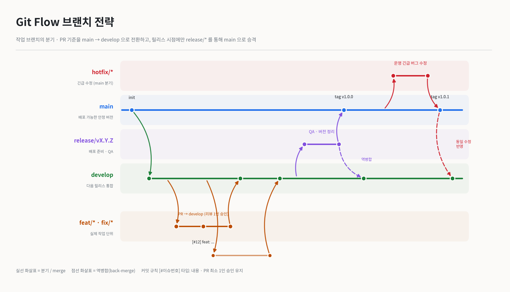

# Git Flow 브랜치 전략

> 이 프로젝트는 Git Flow 브랜치 전략을 따릅니다.
> main과 develop 두 개의 상시 브랜치를 축으로 두고,  
> 목적에 따라 일시적인 브랜치(작업 / 릴리스 / 핫픽스)를 분기했다가 병합 후 삭제하는 구조입니다.

---

## 브랜치 5종

| 브랜치 | 역할 | 분기 위치 | merge 대상 |
|---|---|---|---|
| `main` | 배포 가능한 안정 버전만 유지 | – | – |
| `develop` | 다음 릴리스 통합 브랜치 | `main` | – |
| `feat/*`, `fix/*`, `docs/*` 등 | 실제 작업 단위 (기존 네이밍 유지) | `develop` | `develop` |
| `release/vX.Y.Z` | 배포 준비 (QA, 버전 정리) | `develop` | `main` + `develop` |
| `hotfix/*` | 운영 중 긴급 버그 수정 | `main` | `main` + `develop` |

---

## 커밋 메세지 규칙

- 커밋 메시지 규칙: `[#이슈번호] 타입: 내용`
- PR 리뷰 규칙: 최소 1인 승인

---

## 4. 브랜치 다이어그램



---

## 워크플로우

### 1. 일반 기능 개발

```bash
git checkout develop
git pull origin develop
git checkout -b feat/기능명

# 작업 후
git commit -m "[#12] feat: 기능 설명"
git push origin feat/기능명
# → develop 대상으로 PR 생성 → 리뷰 1인 승인 → merge
```

### 2. 릴리스

```bash
git checkout -b release/v1.0.0 develop
# QA, 버그 픽스, 버전 표기 정리

# 완료 후
#  1) release/v1.0.0 → main PR (merge 후 태그 v1.0.0)
#  2) release/v1.0.0 → develop PR (릴리스 중 수정사항 역병합)
```

### 3. 핫픽스

```bash
git checkout -b hotfix/버그명 main
# 긴급 수정

#  1) hotfix/* → main PR (merge 후 패치 태그)
#  2) hotfix/* → develop PR (동일 수정 반영)
```

---

## GitHub 저장소 보호 규칙 권장사항

- `main` 브랜치 보호: 직접 push 금지, PR 필수, 승인 1인 이상
- `develop` 브랜치 보호: 직접 push 금지, PR 필수
- **default branch를 `develop`으로 변경** (PR 기본 타깃이 develop이 되도록)

---

